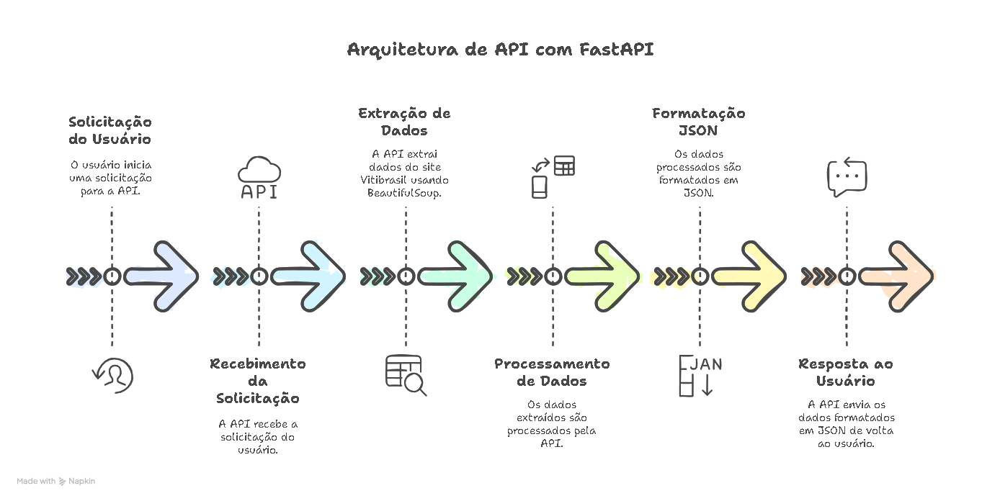

# 🍷 API de Coleta de Dados da Embrapa

Este projeto consiste em uma REST API desenvolvida com **FastAPI** que realiza a raspagem de dados no site da **Embrapa**, protegida com autenticação JWT. O objetivo é permitir a consulta segura de informações públicas coletadas dinamicamente da web.

🚀 Deploy: [https://tech-challenge-fase-01.onrender.com](https://tech-challenge-fase-01.onrender.com)

📘 Projeto desenvolvido como parte do **Tech Challenge - Fase 01** da pós-graduação **Machine Learning Engineering - FIAP**.

---

## 📂 Estrutura do Projeto

```bash
.
├── core/
│   └── security.py               # Implementação da lógica de autenticação e geração de tokens JWT
├── data/
│   └── users.py                  # Lista de usuários autorizados, carregados a partir do arquivo .env
├── datasets/
│   └── *.csv                    # Arquivos CSV de backup usados como fallback em caso de erro 500 na API
├── docs/
│   └── *.pdf                    # Documentação em PDF das solicitações e especificações do projeto
├── image/
│   └── architecture_diagram.png # Diagrama de arquitetura do sistema
├── models/
│   └── item.py                   # Definição dos modelos de dados utilizados pela API
├── routes/
│   ├── auth.py                   # Endpoints de autenticação (login, geração de tokens)
│   └── items.py                  # Endpoints para consulta e manipulação de dados
├── scrapping/
│   ├── site_collector.py         # Módulo responsável pelo scraping dos dados do site Embrapa
│   └── fallback.py               # Implementação do fallback para retornar dados CSV em caso de erro 500
├── main.py                       # Ponto de entrada e inicialização da aplicação FastAPI
├── .env                          # Variáveis de ambiente (não versionar)
└── README.md                     # Documentação principal do projeto

```

---

## ⚙️ Tecnologias Utilizadas

- [Python 3.11](https://www.python.org/)
- [FastAPI](https://fastapi.tiangolo.com/)
- [Uvicorn](https://www.uvicorn.org/)
- [Requests](https://requests.readthedocs.io/)
- [BeautifulSoup4](https://www.crummy.com/software/BeautifulSoup/)
- [Pydantic](https://docs.pydantic.dev/)
- [python-jose](https://python-jose.readthedocs.io/) (JWT)
- [python-multipart](https://andrew-d.github.io/python-multipart/)
- [python-dotenv](https://pypi.org/project/python-dotenv/)
- [pandas](https://pandas.pydata.org)

Gerenciador de dependências: **[Poetry](https://python-poetry.org/)**

---

## 🔧 Clone o repositório

```bash
git clone https://github.com/evandroviero/tech-challenge-fase-01.git
cd tech-challenge-fase-01
```

## 🔐 Variáveis de Ambiente

Crie um arquivo `.env` na raiz do projeto com as seguintes variáveis:

```env
SECRET_KEY=your-secret-key-here
ALGORITHM=HS256
ACCESS_TOKEN_EXPIRE_MINUTES=5

USER_1=username1
PASSWORD_1=senha1

USER_2=username2
PASSWORD_2=senha2

```

> ⚠️ **Atenção:** nunca compartilhe sua `SECRET_KEY` publicamente. Ela deve ser única e segura para garantir a proteção dos tokens JWT.

---

## 📌 Como Executar Localmente

Se ainda não tiver o Poetry instalado:

```bash
curl -sSL https://install.python-poetry.org | python3 -
```

Ou veja as instruções em: [https://python-poetry.org/docs/#installation](https://python-poetry.org/docs/#installation)


```bash
# Instale as dependências
poetry install

# Execute o projeto com uvicorn
poetry run uvicorn main:app --reload
```

---

## 🧪 Testes

Para testar os endpoints protegidos por JWT:

1. Acesse o endpoint de autenticação:

```
POST /login
{
  "username": "usuario",
  "password": "senha"
}
```

2. Use o token recebido para autorizar requisições `POST` nos endpoints de dados.

---

## 🧭 Diagrama de Arquitetura



---

## 🛠️ Próximas Etapas

- 🔄 Salvamento dos dados raspados em um banco SQL
- 🐘 Integração com PostgreSQL ou SQLite
- 🐳 Containerização com Docker
- 📊 Visualização analítica dos dados

---

## 👨‍🎓 Projeto Acadêmico

Este repositório foi desenvolvido como parte do **Tech Challenge - Fase 01** do curso de **Machine Learning Engineering - FIAP**.

